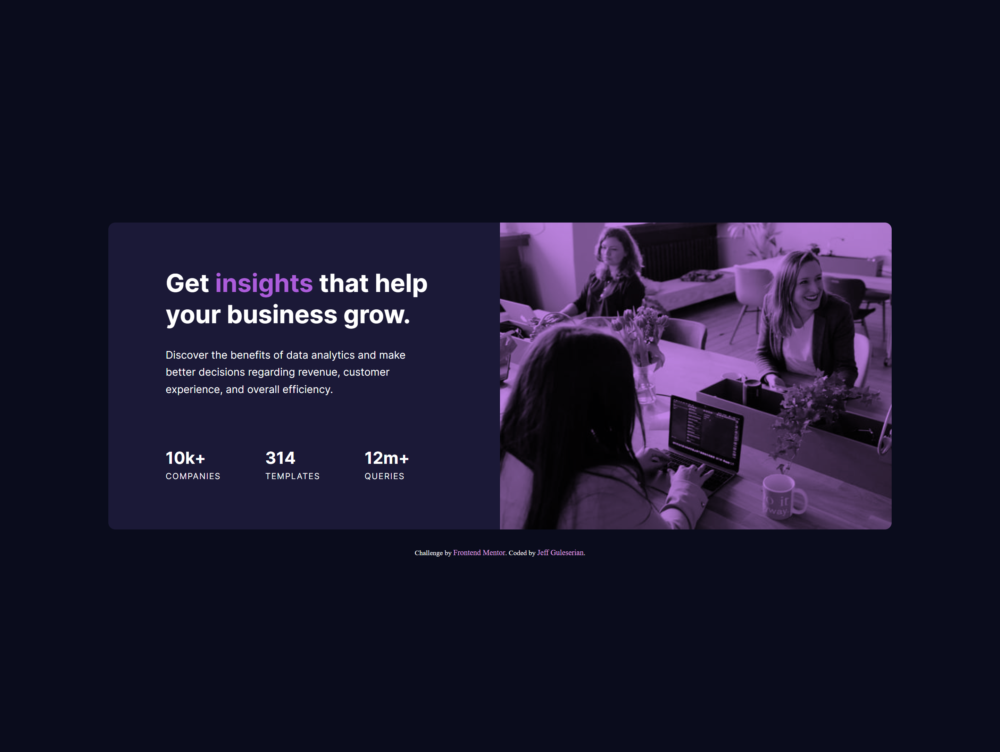

# Frontend Mentor - Stats preview card component solution

This is a solution to the [Stats preview card component challenge on Frontend Mentor](https://www.frontendmentor.io/challenges/stats-preview-card-component-8JqbgoU62). Frontend Mentor challenges help you improve your coding skills by building realistic projects.

## Table of contents

- [Frontend Mentor - Stats preview card component solution](#frontend-mentor---stats-preview-card-component-solution)
  - [Table of contents](#table-of-contents)
  - [Overview](#overview)
    - [The challenge](#the-challenge)
    - [Screenshot](#screenshot)
    - [Links](#links)
  - [My process](#my-process)
    - [Built with](#built-with)
    - [What I learned](#what-i-learned)
    - [Continued development](#continued-development)
    - [AI Collaboration](#ai-collaboration)
  - [Author](#author)

## Overview

### The challenge

Users should be able to:

- View the optimal layout depending on their device's screen size

### Screenshot

### Links

- Solution URL: [Add solution URL here](https://your-solution-url.com)
- Live Site URL: [Add live site URL here](https://your-live-site-url.com)

## My process

1. Unpack original files, create a styles.css, prepare Figma file.
2. Create repository and push it to GitHib.
3. Decide how to structure the page using semantic HTML.
4. Link the style sheet, add appropriate `<meta>` tags and complete HTML.
5. Install fonts and complete reset.
6. Style systematically while comparing with original Figma file.
7. Once mobile design is completed, adjustments are made for the tablet and desktop version.
8. When satisfied with the design, I completed the README.MD file.
9. Push final project to GitHub again.
10. Submit the work to AI (I use Copilot) and process through the feedback making changes as necessary.
11. Final push and submission to FrontendMentor.

### Built with

- Semantic HTML5 markup
- CSS custom properties
- Flexbox
- Mobile-first workflow

### What I learned

While there was nothing ground-breakingly new, I did get to practice a few skills such as using the `clamp` CSS parameter to control the growth and shrinking of padding, font size, and image size. In addition, too advantage of more extensive use of CSS variables, adding spacing and font weight to the list. The point of this is to make editing easier if I come back to the project later, or for working in a team. To change padding, for instance, one only needs to change the size in the variable, and all padding of that size will automatically be updated. The same is true of font-weight, etc.

I also had the opportunity to play with the background-image property a bit and add in a blend-mode, adjust the size, etc.

### Continued development

In my next challenge I am hoping to solidify the skills I have practiced in this project. Each time I repeat the use of these techniques, they become more natural and "second-nature". However, I would like to take on a project with which I have a opportunity to practice a bit of JavaScript.

### AI Collaboration

Before submitting this project to Frontend Mentor, I will be submitting it to Copilot. I have found that it gives me extensive feedback and suggestions for further development. I also take to heart what the AI in Frontend Mentor says, especially about accessibility.

## Author

- GitHub - [@jguleserian](https://github.com/jguleserian)
- Frontend Mentor - [@jguleserian](https://www.frontendmentor.io/profile/jguleserian)
- LinkedIn - [@jeffguleserian](https://www.linkedin.com/jeffguleserian)
